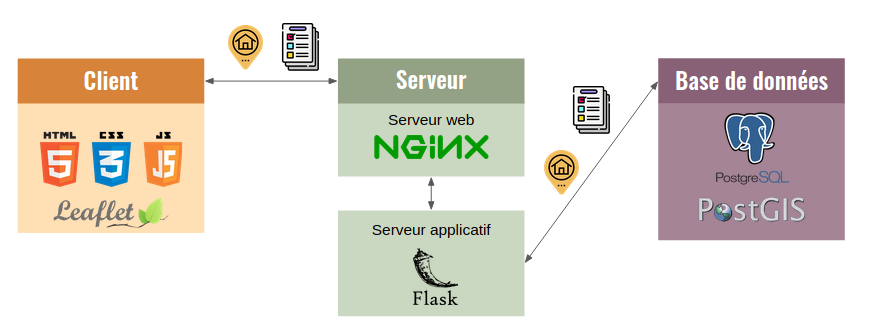

*Projet de fin d'études de 5 géomaticiens et géomaticiennnes prêts à changer le monde*

# ECORCE, l'application qui permet de visualiser nos émissions carbone dans notre paysage local

ECORCE signifie : Estimation de la surfaCe d'absoRption du Carbone Emis.
Derrière cet acronyme alambiqué, une idée simple : si nous projetions nos émissions carbone, évaluées à partir de 
nos habitudes de consommation, sur les espaces végétalisés proches de chez nous, afin de mieux en prendre la mesure ?
ECORCE évalue vos émissions, identifie les espaces végétalisés proches de chez vous et leur capacité à abosrber du CO2, 
et vous permet de visualiser l'espace nécessaire à l'absorption de ces émissions.

*Mais seul, on est tout petit...*

Et oui ! Pour cela ECORCE, rapporte l'estimation de vos émissions à l'ensemble des habitants ou de votre quartier.
# Comment ça marche ? ECORCE en 3 étapes

## 1. Renseignez votre adresse

## 2. Répondez au questionnaire

Un questionnaire permet d'estimer vos émissions de carbone à partir de trois postes de consommation principaux : l'alimentation, les transports et l'énergie domestique.

## 3. Visualiser votre carte des émissions carbones !

Vous pouvez également consulter les émissions carbones de votre quartier si ses habitants étaient des "Français moyens" (en orange), ou si chacun consommait de manière à éviter une hausse des températures mondiales moyennes de plus de 1,5°C d'ici 2050 (en violet) : 

Vous pouvez également modifier vos réponses et visualiser l'impact qu'auraient ces changements de modes de consommation sur vos émissions de carbone (en vert foncé) :

Enfin, observez la part respective des trois postes de consommation dans vos émissions de CO2 :

# Une application web basée sur une architecture 3 tiers
ECORCE est une application Flask (librarie Python) servie par Nginx, avec une carto portée par Leaflet, et des données structurées par PostgreSQL et PostGIS :

